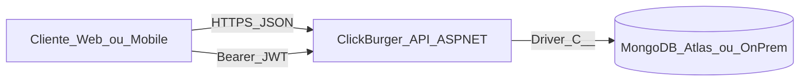

# Documentação — Etapa 2 (Web API + NoSQL)

## 1. Arquitetura distribuída (H24a, H24b)

### 1.1 Contexto

### 1.2 Componentes

- **API**: stateless, autenticação por JWT (assinatura simétrica local).
- **MongoDB**: persistência documental; índices únicos em usuário/mesa e TTL em refresh tokens (ver seção 3).
- **Cliente**: consome JSON; CORS configurável via `Cors:AllowedOrigins` (lista vazia = `AllowAnyOrigin` apenas para facilitar desenvolvimento).

### 1.3 Análise crítica (desempenho, segurança, disponibilidade)

- **Latência**: pedidos com itens **embutidos** no documento `Order` reduzem round-trips em relação a normalização relacional pura.
- **Disponibilidade**: Atlas oferece replicação; a API deve ser implantada atrás de HTTPS com segredos em variáveis de ambiente.
- **Segurança**: `PasswordHash` nunca é exposto em DTOs; refresh tokens armazenados no banco podem ser revogados (rotação a cada refresh); em produção restringir CORS e desabilitar Swagger público.

## 2. Modelo de dados NoSQL (H23a, H25a, H25b)

### 2.1 Por que documento (MongoDB)

- Cardápio, mesas e pedidos mapeiam naturalmente para **documentos JSON**.
- **Itens de pedido** são **embedded** em `Order`: leitura em uma consulta, **snapshot** de `UnitPrice` e nome no momento do pedido (o preço do cardápio pode mudar depois).

### 2.2 Índices (implementados na subida da API)

| Coleção | Índice | Objetivo |
|---------|--------|----------|
| Users | único `Username`, único `Email` | integridade e login rápido |
| Tables | único `Number` | uma mesa por número |
| Orders | `TableId` + `CreatedAt` | listagens por mesa |
| RefreshTokens | único `Token` | lookup do refresh; TTL em `ExpiresAt` para limpeza |

### 2.3 “Normalização” em NoSQL

Evitamos duplicar **cardápio** dentro de cada pedido além do necessário: guardamos `MenuItemId` + snapshot de nome/preço para auditoria e performance de leitura.

## 3. API e autenticação

### 3.1 OAuth 2.0 e JWT

- **Access token**: JWT Bearer (curta duração, configurável em `Jwt:ExpirationMinutes` / legado `Jwt:ExpirationHours`).
- **Refresh token**: opaco, persistido em MongoDB; `POST /api/auth/refresh` emite novo par (rotação), alinhado ao *refresh token grant* da RFC 6749.

### 3.2 Papéis

| Papel | Uso típico |
|-------|------------|
| `admin` | CRUD cardápio (admin), gestão de usuários staff |
| `garcom` | Mesas e pedidos |
| `user` | Cliente cadastrado; rotas staff/admin exigem papéis superiores |

## 4. Testes automatizados (H27a)

Projeto `ClickBurger.Tests`: regras de transição de pedido (`OrderWorkflow`) e validadores FluentValidation. CI em GitHub Actions executa `dotnet test`.
